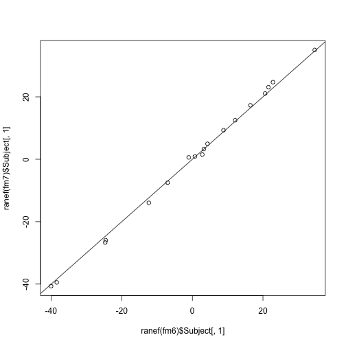

Using `glmer` to fit LMMs
=========================

Using the `blme` branch of development `lme4`, which doesn't dispatch `lmer` when `glmer` with `family=gaussian` is called.

```r
library(lme4)
```

```
## Loading required package: lattice
```

```
## Loading required package: Matrix
```

```
## Loading required package: Rcpp
```

```
## Loading required package: RcppEigen
```

```r
sleepstudy$obs <- as.factor(seq_len(nrow(sleepstudy)))
```


However, note that `lmer` and `glmer` don't give identical results (except for fixed effect point estimates):

```r
(fm1 <- lmer(Reaction ~ Days + (Days | Subject), sleepstudy))
```

```
## Linear mixed model fit by REML ['lmerMod']
## Formula: Reaction ~ Days + (Days | Subject) 
##    Data: sleepstudy 
## 
## REML criterion at convergence: 1744 
## 
## Random effects:
##  Groups   Name        Variance Std.Dev. Corr 
##  Subject  (Intercept) 612.1    24.74         
##           Days         35.1     5.92    0.066
##  Residual             654.9    25.59         
## Number of obs: 180, groups: Subject, 18
## 
## Fixed effects:
##             Estimate Std. Error t value
## (Intercept)   251.41       6.82    36.8
## Days           10.47       1.55     6.8
## 
## Correlation of Fixed Effects:
##      (Intr)
## Days -0.138
```

```r
(fm2 <- glmer(Reaction ~ Days + (Days | Subject), sleepstudy, family = gaussian))
```

```
## Generalized linear mixed model fit by maximum likelihood ['glmerMod']
##  Family: gaussian ( identity )
## Formula: Reaction ~ Days + (Days | Subject) 
##    Data: sleepstudy 
## 
##      AIC      BIC   logLik deviance 
##   1891.4   1907.4   -940.7   1881.4 
## 
## Random effects:
##  Groups  Name        Variance Std.Dev. Corr 
##  Subject (Intercept) 241.3    15.53         
##          Days         22.8     4.78    1.000
## Number of obs: 180, groups: Subject, 18
## 
## Fixed effects:
##             Estimate Std. Error z value Pr(>|z|)    
## (Intercept)   251.41       3.66    68.6   <2e-16 ***
## Days           10.47       1.13     9.3   <2e-16 ***
## ---
## Signif. codes:  0 '***' 0.001 '**' 0.01 '*' 0.05 '.' 0.1 ' ' 1 
## 
## Correlation of Fixed Effects:
##      (Intr)
## Days 0.998
```


The approach of using observation-level random effects doesn't work either:

```r
(fm3 <- glmer(Reaction ~ Days + (Days | Subject) + (1 | obs), sleepstudy, family = gaussian))
```

```
## Error: Downdated VtV is not positive definite
```


But at least this approach works when there are no other random effects:

```r
(fm4 <- glmer(Reaction ~ Days + (1 | obs), sleepstudy, family = gaussian))
```

```
## Generalized linear mixed model fit by maximum likelihood ['glmerMod']
##  Family: gaussian ( identity )
## Formula: Reaction ~ Days + (1 | obs) 
##    Data: sleepstudy 
## 
##      AIC      BIC   logLik deviance 
##   1908.3   1917.9   -951.1   1902.3 
## 
## Random effects:
##  Groups Name        Variance Std.Dev.
##  obs    (Intercept) 0        0       
## Number of obs: 180, groups: obs, 180
## 
## Fixed effects:
##             Estimate Std. Error z value Pr(>|z|)    
## (Intercept) 251.4051     0.1385    1815   <2e-16 ***
## Days         10.4673     0.0259     403   <2e-16 ***
## ---
## Signif. codes:  0 '***' 0.001 '**' 0.01 '*' 0.05 '.' 0.1 ' ' 1 
## 
## Correlation of Fixed Effects:
##      (Intr)
## Days -0.843
```

```r
(fm5 <- lm(Reaction ~ Days, sleepstudy))
```

```
## 
## Call:
## lm(formula = Reaction ~ Days, data = sleepstudy)
## 
## Coefficients:
## (Intercept)         Days  
##       251.4         10.5
```


Maybe some progress by setting the weights to be equal to the estimated residual variance from a `REML=FALSE` `lmer` fit:

```r
(fm6 <- lmer(Reaction ~ Days + (Days | Subject), sleepstudy, REML = FALSE))
```

```
## Linear mixed model fit by maximum likelihood ['lmerMod']
## Formula: Reaction ~ Days + (Days | Subject) 
##    Data: sleepstudy 
## 
##      AIC      BIC   logLik deviance 
##     1764     1783     -876     1752 
## 
## Random effects:
##  Groups   Name        Variance Std.Dev. Corr 
##  Subject  (Intercept) 565.5    23.78         
##           Days         32.7     5.72    0.081
##  Residual             654.9    25.59         
## Number of obs: 180, groups: Subject, 18
## 
## Fixed effects:
##             Estimate Std. Error t value
## (Intercept)   251.41       6.63    37.9
## Days           10.47       1.50     7.0
## 
## Correlation of Fixed Effects:
##      (Intr)
## Days -0.138
```

```r
(fm7 <- glmer(Reaction ~ Days + (Days | Subject), sleepstudy, family = gaussian, 
    weights = rep(1/654.94, nrow(sleepstudy))))
```

```
## Generalized linear mixed model fit by maximum likelihood ['glmerMod']
##  Family: gaussian ( identity )
## Formula: Reaction ~ Days + (Days | Subject) 
##    Data: sleepstudy 
## 
##      AIC      BIC   logLik deviance 
##   1761.3   1777.3   -875.7   1751.3 
## 
## Random effects:
##  Groups  Name        Variance Std.Dev. Corr  
##  Subject (Intercept) 644.9    25.39          
##          Days         35.5     5.96    -0.008
## Number of obs: 180, groups: Subject, 18
## 
## Fixed effects:
##             Estimate Std. Error z value Pr(>|z|)    
## (Intercept)   251.41       6.96    36.1  < 2e-16 ***
## Days           10.47       1.55     6.7  1.6e-11 ***
## ---
## Signif. codes:  0 '***' 0.001 '**' 0.01 '*' 0.05 '.' 0.1 ' ' 1 
## 
## Correlation of Fixed Effects:
##      (Intr)
## Days -0.190
```

This gets the fixed effect standard errors much better as well as the random effects variances.  However, the random effects variances are far from perfect, and the random effects correlation is still way off.


Further experimentation:

```r
plot(ranef(fm1)$Subject[, 1], ranef(fm2)$Subject[, 1])
abline(a = 0, b = 1)
```

 

```r

lmod <- lFormula(Reaction ~ Days + (Days | Subject), sleepstudy)
devfun <- do.call(mkLmerDevfun, lmod)
opt <- optimizeLmer(devfun)
rho <- environment(devfun)


glmod <- glFormula(Reaction ~ Days + (Days | Subject), sleepstudy, family = gaussian)
devfun <- do.call(mkGlmerDevfun, glmod)
opt <- optimizeGlmer(devfun)
devfun <- updateGlmerDevfun(devfun, glmod$reTrms)
opt <- optimizeGlmer(devfun, stage = 2)
rho <- environment(devfun)
rho$resp$Laplace
```

```
## Class method definition for method Laplace()
## function (ldL2, ldRX2, sqrL) 
## {
##     "returns the Laplace approximation to the profiled deviance"
##     .Call(glm_Laplace, ptr(), ldL2, ldRX2, sqrL)
## }
## <environment: 0x109622118>
## 
##  Methods used:  
##     "ptr"
```

```r


devfun(rho$pp$theta)
```

```
## [1] 3254
```

```r
devfun(rho$pp$theta)
```

```
## [1] 3254
```


Where does `useSc` occur?
-------------------------

### lmer.R

#### logLik.merMod
line 952:
`attr(val, "df") <- length(object@beta) + length(object@theta) + dims[["useSc"]]`

#### refitML.merMod
line 1192:
`dims <- c(N=n, n=n, nmp=n-p, nth=length(pp$theta), p=p, q=nrow(pp$Zt), nAGQ=NA_integer_, useSc=1L, reTrms=length(x@cnms), spFe=0L, REML=0L, GLMM=0L, NLMM=0L)`

#### sigma.merMod
line 1252:
`if(dd[["useSc"]]) dc$cmp[[if(dd[["REML"]]) "sigmaREML" else "sigmaML"]] else 1.`

#### VarCorr.merMod
line 1817:
`attr(m,"useSc") <- as.logical(x@devcomp$dims["useSc"])`

#### summary.merMod
line 1882:
`useSc <- as.logical(dd["useSc"])`

line 1895:
`colnames(coefs)[3] <- paste(if(useSc) "t" else "z", "value")`

line 1918
`structure(list(methTitle=mName, devcomp=devC, isLmer=is(resp, "lmerResp"), useScale=useSc, logLik=llik, family=fam, link=link, ngrps=sapply(object@flist, function(x) length(levels(x))), coefficients=coefs, sigma=sig, vcov=vcov(object, correlation=TRUE, sigm=sig), varcor=varcor, AICtab=AICstats, call=object@call), class = "summary.merMod") # and use formatVC(.) for printing. `

### profile.R

#### profile.merMod
line 73:
`useSc <- isLMM(fitted) || isNLMM(fitted)`

line 74:
`dd <- devfun2(fitted,useSc)`

line 180:
`if (useSc) {lower <- c(lower,0); upper <- c(upper,Inf)}`

#### devfun2
line 355:
`devfun2 <- function(fm,useSc=TRUE)`

line 403:
 `## FIXME: allow useSc (i.e. NLMMs)`
            if (!useSc) {
                thpars <- Sv_to_Cv(pars[seq(np)],n=vlist)
            } else {
                thpars <- Sv_to_Cv(pars[seq(np)],n=vlist,s=pars[np])
            }


### utilities.R

#### mkMerMod
line 538:
`dims <- c(N=nrow(pp$X), n=n, p=p, nmp=n-p, nth=length(pp$theta), q=nrow(pp$Zt), nAGQ=rho$nAGQ,compDev=rho$compDev, useSc=(rcl != "glmResp"), reTrms=length(reTrms$cnms), spFe=0L,REML=if (rcl=="lmerResp") resp$REML else 0L,  GLMM=(rcl=="glmResp"), NLMM=(rcl=="nlsResp"))## FIXME: need to consider GLM families with estimated scale parameter!`
